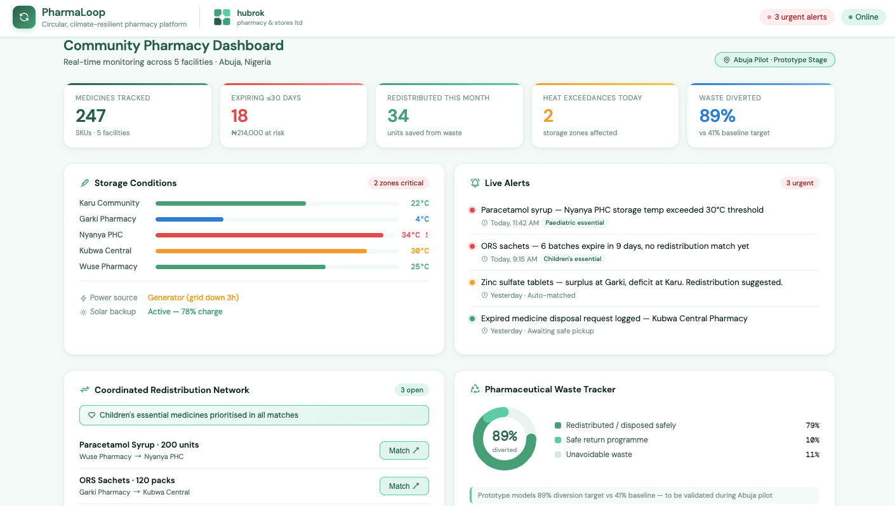
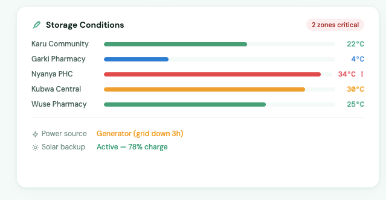
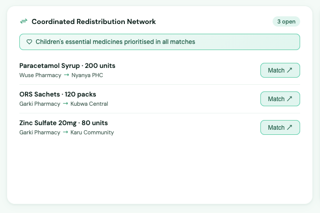
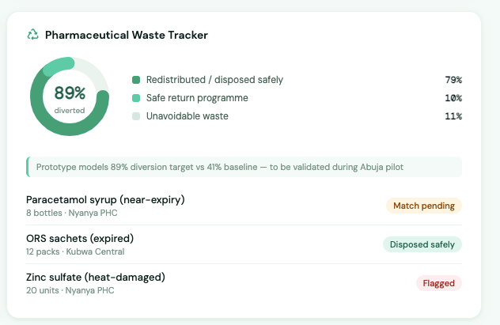

# PharmaLoop

PharmaLoop is a circular, climate-resilient pharmacy platform that reduces medicine waste, improves equitable access, and strengthens healthcare readiness in climate-vulnerable communities across Nigeria.

---

## The Problem

In Nigeria, a significant proportion of medicines are lost annually due to poor storage conditions, heat exposure, erratic power supply, and expiry before use. Across the country, community pharmacies - from peri-urban satellite settlements to established urban centres - often operate without real-time inventory systems, limiting their ability to manage stock proactively and efficiently. Heat exposure further compounds these challenges by compromising the quality of temperature-sensitive medicines, including formulations commonly used in child health and essential care.

Improper disposal of expired pharmaceuticals also contributes to soil and water contamination, creating secondary environmental and public health risks. Fragmented distribution systems frequently result in medicine surpluses in one facility and shortages in another, even within the same community. Children and other vulnerable populations often bear the greatest burden, as delayed access to safe and effective medicines worsens preventable health outcomes. Existing pharmacy systems often lack integrated tools for climate-resilient monitoring, inventory redistribution, and responsible pharmaceutical waste management, limiting their ability to respond effectively to these challenges.

---

## The Solution

PharmaLoop is a circular, climate-resilient pharmacy platform that improves how essential medicines are stored, managed, redistributed, and safely disposed of at the community level. The platform integrates real-time heat and power monitoring, AI-assisted expiry tracking, a coordinated redistribution network connecting surplus and deficit facilities, and a structured pharmaceutical waste management system within a single open-source tool built for low-connectivity environments.

| Module | What it does |
|--------|-------------|
| Climate & Storage Monitoring | Real-time heat and power alerts protecting medicine integrity |
| Expiry Risk Tracking | AI-assisted scoring to flag high-risk medicines before loss occurs |
| Coordinated Redistribution Network | Voluntary matching between surplus facilities and facilities with shortages |
| Pharmaceutical Waste Tracker | Structured disposal workflows to support environmental responsibility |

PharmaLoop helps community pharmacies anticipate health needs linked to seasonal and climate-related patterns, reducing medicine loss caused by heat exposure, expiry, and poor stock management. Eligible near-expiry medicines are matched for redistribution before waste occurs. Children's essential medicines such as Oral Rehydration Salts, Zinc sulfate, and Paracetamol are prioritised within the alert and redistribution logic.

The result is stronger medicine continuity, reduced pharmaceutical waste, and more equitable access to safe medicines for vulnerable populations across Nigeria.

---

## Current Prototype

The current prototype demonstrates core PharmaLoop workflows using simulated pharmacy operational data modelled on real community pharmacy settings in Abuja, Nigeria.

### Prototype Modules
- Climate and storage monitoring dashboard
- Expiry risk identification and alert engine
- Coordinated redistribution matching interface
- Pharmaceutical waste tracking workflow

### Dashboard Preview

*Full PharmaLoop dashboard — real-time overview across 5 Abuja community pharmacy facilities.*

*Climate and storage monitoring module — live temperature tracking and power supply status across all zones.*

*Coordinated redistribution network — voluntary matching of surplus and deficit facilities, with children's essential medicines prioritised.*

*Pharmaceutical waste tracker — monitoring safe disposal and diversion rates against baseline targets.*

---

## Planned Technology Stack

- Web-based frontend dashboard — cloud-based, mobile-responsive system optimised for low-connectivity environments, with resilient session handling and core workflow continuity during network disruptions.
- Backend services for pharmacy operations management, secure data processing, inventory tracking, and expiry risk analytics.
- Structured relational database for medicine stock, pharmacy facilities, suppliers, and transaction data, designed for traceability and auditability.
- Artificial Intelligence layer for expiry risk scoring, basic demand forecasting, and inventory redistribution matching across pharmacy networks.
- Natural language interface for inventory queries, reporting, and operational insights (future phase).
- IoT integration for real-time monitoring of temperature and power stability in pharmacy storage environments.
- Event-driven notification system for alerts such as stock depletion, expiry risk, temperature breaches, and supply chain updates.
- All components designed with modular architecture principles and extensibility for future scaling.

---

## 12-Month Pilot Roadmap

| Phase | Timeline | Focus Area | Key Deliverables | Outcome |
|-------|----------|------------|------------------|---------|
| **Phase 1: Prototype Refinement** | Months 1–2 | Product + system finalisation | Refine dashboard UI, finalise data architecture, define governance and compliance protocols | Stable MVP foundation and system clarity |
| **Phase 2: Sensor Integration** | Months 3–4 | IoT deployment | Deploy temperature and power monitoring sensors across selected pilot facilities | Real-time climate data capture enabled |
| **Phase 3: Pilot Onboarding** | Months 4–5 | User adoption | Onboard 3–5 community pharmacies in Abuja and conduct operational training | Active pilot network established |
| **Phase 4: Data Collection & Intelligence layer** | Months 5–8 | Operational intelligence | Collect structured operational data on inventory movement, expiry trends, medicine waste patterns and begin development of baseline analytics and predictive models | Real-world dataset for analysis |
| **Phase 5: Evaluation, Validation & Model Refinement** | Months 8–10 | Impact assessment | Evaluate pilot performance and refine initial predictive models for expiry risk, demand trends, and redistribution opportunities based on real-world data | Evidence of system effectiveness |
| **Phase 6: Scale Planning** | Months 11–12 | Expansion readiness | Refine system based on pilot feedback and prepare structured scale-up roadmap for additional regions | Deployment-ready expansion model |

---

## Team

PharmaLoop is built by a multidisciplinary team of four (4) professionals combining pharmaceutical expertise, technology development, and community health experience.

Our founder brings hands-on community pharmacy practice experience, having directly identified the medicine access gaps and wastage challanges that PharmaLoop is designed to solve from within the system.

---

## Open Source Commitment

PharmaLoop is committed to open-source principles. All code, documentation, and data frameworks developed through this project will be published under the MIT Licence and made freely available for adaptation by health innovators across Africa and beyond.

We believe that solutions to public health challenges should be openly accessible, especially in resource-constrained settings where proprietary tools create barriers rather than bridges.

---

## UNICEF Venture Fund

PharmaLoop is an open-source climate and child health innovation aligned with the objectives of the UNICEF Venture Fund Climate + Health cohort. Developed by HUBROK PHARMACY & STORES LTD, a registered community pharmacy business in Abuja, Nigeria, PharmaLoop combines frontline pharmaceutical expertise with technology to address climate-driven challenges affecting medicine quality, access, and continuity for children and vulnerable populations.

---

## Contact & Project Lead

**Nonyelum Christie-Sandra Okpagu**

Founder & Lead Pharmacist | PharmaLoop  
HUBROK PHARMACY & STORES LTD  
Abuja, Nigeria  

Email: hubrokpharmacy.stores@gmail.com 
GitHub: https://github.com/pharmaloop-ng

---

*PharmaLoop — closing the loop on medicine waste, protecting the next generation.* 
